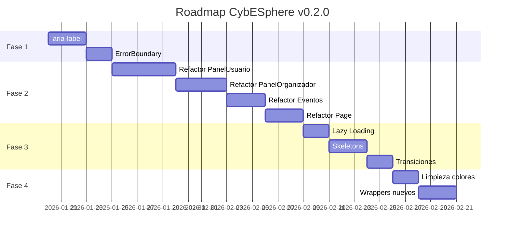

# 📋 Plan de Implementación: CybESphere v0.2.0

> **Documento Técnico Completo** > **Fecha:** Enero 2026
> **Estado:** Validado contra código real
> **Versión:** 2.0

---

## 📊 Inventario del Proyecto (Validado)

### Frontend (`src/`)

| Directorio      | Archivos | Tamaño Total | Observaciones            |
| --------------- | -------- | ------------ | ------------------------ |
| `components/`   | 15       | 87 KB        | 3 componentes > 8KB      |
| `pages/`        | 16       | 272 KB       | **4 monolíticos** > 29KB |
| `services/api/` | 8        | 15 KB        | Bien modularizados       |
| `hooks/`        | 4        | 7.6 KB       | Bien estructurados       |
| `context/`      | 1        | 4.3 KB       | AuthContext              |
| `types/`        | 1        | 12.6 KB      | 668 líneas, completo     |
| `constants/`    | 1        | 3.5 KB       | Solo filters.ts          |

### Backend (`internal/`)

| Directorio      | Archivos | Observaciones                |
| --------------- | -------- | ---------------------------- |
| `handlers/`     | 10       | Incluye review_handler.go ✅ |
| `services/`     | 9        | ReviewService incluido ✅    |
| `repositories/` | 9        | Completo                     |
| `models/`       | 12       | DeletedAt en base.go ✅      |
| `routes/`       | 1        | 959 líneas, todas las rutas  |

---

## 🔍 Hallazgos del Análisis

### ✅ Lo que funciona correctamente

| Sistema    | Estado       | Archivos                                                  |
| ---------- | ------------ | --------------------------------------------------------- |
| Reviews    | ✅ Completo  | `review_handler.go`, `reviews.service.ts`, rutas L277-279 |
| SoftDelete | ✅ GORM      | `base.go:16` - DeletedAt automático                       |
| Auth JWT   | ✅ Completo  | `AuthContext.tsx`, `auth.service.ts`                      |
| RBAC       | ✅ Completo  | Admin/Organizer/User en routes.go                         |
| Button     | ✅ Unificado | `Button.tsx` - wrapper MUI + CSS vars                     |
| Services   | ✅ Modulares | 8 archivos en `services/api/`                             |
| Types      | ✅ Completo  | 668 líneas, todos los DTOs                                |

### ❌ Lo que falta o necesita mejora

| Problema                | Severidad | Archivos Afectados                    |
| ----------------------- | --------- | ------------------------------------- |
| Componentes monolíticos | 🔴 Alta   | 4 archivos > 800 líneas               |
| aria-label              | 🟠 Media  | Header, Footer, EventCard, MobileMenu |
| ErrorBoundary           | 🟠 Media  | No existe                             |
| React.lazy (mapas)      | 🟡 Baja   | SingleEventMap, EventMap              |
| Skeleton loaders        | 🟡 Baja   | No existen                            |
| AnimatePresence         | 🟡 Baja   | framer-motion instalado pero no usado |
| Testing                 | 🟡 Baja   | Solo testing-library, sin runner      |

---

## Fase 1: Estabilización

**Duración estimada:** 1-2 semanas
**Riesgo de rotura:** Bajo

### 1.1 Accesibilidad (aria-label)

**Archivos a modificar:**

```
src/components/
├── Header.tsx
│   ├── L115: IconButton notificaciones → añadir aria-label="Notificaciones"
│   ├── L145: IconButton hamburguesa → añadir aria-label="Abrir menú"
│   └── L230: Logo clickeable → añadir aria-label="Ir a inicio"
│
├── Footer.tsx
│   ├── L70: Link LinkedIn → aria-label="LinkedIn de CybESphere"
│   ├── L75: Link Twitter → aria-label="Twitter de CybESphere"
│   └── L80: Link GitHub → aria-label="GitHub de CybESphere"
│
├── EventCard.tsx
│   └── L150: IconButton bookmark → aria-label="Guardar evento"
│
└── MobileMenu.tsx
    └── L115: IconButton cerrar → aria-label="Cerrar menú"
```

**Ejemplo de cambio:**

```tsx
// ANTES
<IconButton onClick={handleOpenNotifications}>
  <NotificationsIcon />
</IconButton>

// DESPUÉS
<IconButton
  onClick={handleOpenNotifications}
  aria-label="Notificaciones"
>
  <NotificationsIcon />
</IconButton>
```

### 1.2 Error Boundaries

**Archivo nuevo:** `src/components/ErrorBoundary.tsx`

```tsx
import React, { Component, ErrorInfo, ReactNode } from 'react'
import { Box, Typography, Button } from '@mui/material'

interface Props {
  children: ReactNode
  fallback?: ReactNode
}

interface State {
  hasError: boolean
  error: Error | null
}

export class ErrorBoundary extends Component<Props, State> {
  public state: State = {
    hasError: false,
    error: null
  }

  public static getDerivedStateFromError(error: Error): State {
    return { hasError: true, error }
  }

  public componentDidCatch(error: Error, errorInfo: ErrorInfo) {
    console.error('ErrorBoundary caught:', error, errorInfo)
  }

  public render() {
    if (this.state.hasError) {
      return (
        this.props.fallback || (
          <Box sx={{ p: 4, textAlign: 'center' }}>
            <Typography variant='h6' color='error'>
              Algo salió mal
            </Typography>
            <Typography variant='body2' color='text.secondary' sx={{ mb: 2 }}>
              {this.state.error?.message}
            </Typography>
            <Button
              variant='outlined'
              onClick={() => this.setState({ hasError: false, error: null })}
            >
              Intentar de nuevo
            </Button>
          </Box>
        )
      )
    }

    return this.props.children
  }
}
```

**Uso en componentes críticos:**

```
src/pages/Eventos.tsx          → Envolver SingleEventMap
src/components/EventMap.tsx    → Envolver MapContainer
src/pages/Page.tsx             → Envolver formulario completo
```

---

## Fase 2: Refactorización de Componentes

**Duración estimada:** 2-3 semanas
**Riesgo de rotura:** Medio (requiere tests manuales)

### 2.1 Refactorizar `PanelDeUsuario.tsx`

**Situación actual:** 1328 líneas, 2 componentes internos

**Estructura propuesta:**

```
src/pages/
├── PanelDeUsuario.tsx (orquestador, ~150 líneas)
│
└── panel-usuario/
    ├── index.ts (re-exports)
    │
    ├── tabs/
    │   ├── ProfileTab.tsx (~300 líneas)
    │   │   └── Formulario de edición de perfil
    │   │
    │   ├── EventsTab.tsx (~200 líneas)
    │   │   └── Historial + Próximos eventos
    │   │
    │   ├── BookmarksTab.tsx (~150 líneas)
    │   │   └── Lista de favoritos
    │   │
    │   └── NotificationsTab.tsx (~150 líneas)
    │       └── Lista de notificaciones
    │
    └── components/
        ├── BadgeUploader.tsx (~200 líneas)
        │   └── Upload + grid de badges
        │
        ├── ReviewModal.tsx (~150 líneas)
        │   └── Modal para dejar reseña
        │
        └── ProfileHeader.tsx (~100 líneas)
            └── Hero con avatar y stats
```

**Migración paso a paso:**

1. Crear directorio `src/pages/panel-usuario/`
2. Extraer `EditProfileForm` → `ProfileTab.tsx`
3. Extraer lógica de badges → `BadgeUploader.tsx`
4. Extraer modal de review → `ReviewModal.tsx`
5. Crear tabs restantes
6. Refactorizar `PanelDeUsuario.tsx` como orquestador

### 2.2 Refactorizar `PanelDeOrganizador.tsx`

**Situación actual:** 1197 líneas, 2 componentes internos (`StatCard`, `ProfileTabContent`)

**Estructura propuesta:**

```
src/pages/
├── PanelDeOrganizador.tsx (orquestador, ~150 líneas)
│
└── panel-organizador/
    ├── index.ts
    │
    ├── tabs/
    │   ├── DashboardTab.tsx (~250 líneas)
    │   │   └── Stats + KPIs + gráficos
    │   │
    │   ├── EventsListTab.tsx (~250 líneas)
    │   │   └── CRUD de eventos
    │   │
    │   └── ProfileTab.tsx (~400 líneas)
    │       └── Formulario de organización
    │
    └── components/
        ├── StatCard.tsx (~80 líneas)
        │   └── Tarjeta de estadística (ya existe inline)
        │
        └── OrgProfileForm.tsx (~300 líneas)
            └── Formulario completo de org
```

### 2.3 Refactorizar `Eventos.tsx`

**Situación actual:** 873 líneas, página de detalle de evento

**Estructura propuesta:**

```
src/pages/
├── Eventos.tsx (orquestador, ~150 líneas)
│
└── evento-detalle/
    ├── index.ts
    │
    └── components/
        ├── EventHero.tsx (~100 líneas)
        │   └── Banner + título + organización
        │
        ├── EventDetails.tsx (~100 líneas)
        │   └── Categoría + nivel + tags
        │
        ├── EventItinerary.tsx (~200 líneas)
        │   └── Agenda + Ponentes
        │
        ├── EventReviews.tsx (~200 líneas)
        │   └── Lista de reseñas + rating
        │
        └── EventSidebar.tsx (~150 líneas)
            └── Precio + ubicación + botón inscripción
```

### 2.4 Refactorizar `Page.tsx`

**Situación actual:** 844 líneas, formulario de creación de evento

**Estructura propuesta:**

```
src/pages/
├── Page.tsx → renombrar a CrearEvento.tsx (orquestador, ~200 líneas)
│
└── crear-evento/
    ├── index.ts
    │
    ├── sections/
    │   ├── BasicInfoSection.tsx (~150 líneas)
    │   │   └── Título, descripción, tipo, nivel
    │   │
    │   ├── DateLocationSection.tsx (~200 líneas)
    │   │   └── Fechas + ubicación + mapa
    │   │
    │   ├── CapacityPriceSection.tsx (~100 líneas)
    │   │   └── Aforo + precio
    │   │
    │   ├── AgendaSection.tsx (~150 líneas)
    │   │   └── Items de agenda dinámicos
    │   │
    │   └── SpeakersSection.tsx (~150 líneas)
    │       └── Ponentes dinámicos
    │
    └── hooks/
        └── useEventForm.ts (~100 líneas)
            └── Lógica de react-hook-form extraída
```

---

## Fase 3: Optimización de Rendimiento

**Duración estimada:** 1-2 semanas
**Riesgo de rotura:** Bajo

### 3.1 Lazy Loading para Mapas

**Archivos a modificar:**

```
src/components/SingleEventMap.tsx
src/components/EventMap.tsx
```

**Implementación:**

```tsx
// src/components/LazyMap.tsx
import React, { Suspense, lazy } from 'react'
import { Skeleton } from '@mui/material'

const SingleEventMap = lazy(() => import('./SingleEventMap'))
const EventMap = lazy(() => import('./EventMap'))

const MapSkeleton = () => (
  <Skeleton variant='rectangular' height={300} sx={{ borderRadius: 2 }} />
)

export const LazySingleEventMap: React.FC<Props> = (props) => (
  <Suspense fallback={<MapSkeleton />}>
    <SingleEventMap {...props} />
  </Suspense>
)

export const LazyEventMap: React.FC<Props> = (props) => (
  <Suspense fallback={<MapSkeleton />}>
    <EventMap {...props} />
  </Suspense>
)
```

**Archivos a actualizar:**

```
src/pages/Eventos.tsx         → usar LazySingleEventMap
src/pages/LandingPage.tsx     → usar LazyEventMap
```

### 3.2 Skeleton Loaders

**Archivos nuevos:**

```
src/components/skeletons/
├── index.ts
├── EventCardSkeleton.tsx
├── EventDetailSkeleton.tsx
├── PanelSkeleton.tsx
└── ProfileSkeleton.tsx
```

**Ejemplo `EventCardSkeleton.tsx`:**

```tsx
import { Box, Skeleton, Grid } from '@mui/material'

export const EventCardSkeleton = () => (
  <Grid size={{ xs: 12 }}>
    <Box sx={{ display: 'flex', gap: 2, p: 2 }}>
      <Skeleton
        variant='rectangular'
        width={200}
        height={160}
        sx={{ borderRadius: 2 }}
      />
      <Box sx={{ flex: 1 }}>
        <Skeleton variant='text' width='60%' height={32} />
        <Skeleton variant='text' width='90%' />
        <Skeleton variant='text' width='40%' />
        <Box sx={{ display: 'flex', gap: 1, mt: 2 }}>
          <Skeleton variant='rounded' width={80} height={24} />
          <Skeleton variant='rounded' width={80} height={24} />
        </Box>
      </Box>
    </Box>
  </Grid>
)
```

### 3.3 Transiciones de Ruta

**Archivo a modificar:** `src/App.tsx`

```tsx
import { AnimatePresence, motion } from 'framer-motion'

const PageTransition = ({ children }) => (
  <motion.div
    initial={{ opacity: 0, y: 20 }}
    animate={{ opacity: 1, y: 0 }}
    exit={{ opacity: 0, y: -20 }}
    transition={{ duration: 0.2 }}
  >
    {children}
  </motion.div>
)

// En AppWrapper:
<AnimatePresence mode="wait">
  <PageTransition key={location.pathname}>
    <Outlet />
  </PageTransition>
</AnimatePresence>
```

---

## Fase 4: Sistema de Diseño

**Duración estimada:** 1 semana
**Riesgo de rotura:** Bajo

### 4.1 Mantener Enfoque Híbrido

El proyecto ya usa un enfoque híbrido correcto:

```
┌─────────────────────────────────────────┐
│ global.css                              │
│ └── CSS Variables (colores, gradientes) │
└─────────────────────────────────────────┘
              ↓
┌─────────────────────────────────────────┐
│ Button.tsx, Card wrappers              │
│ └── sx={{ var(--color-cadetblue) }}    │
└─────────────────────────────────────────┘
              ↓
┌─────────────────────────────────────────┐
│ MUI Components                          │
│ └── Accesibilidad + Layout             │
└─────────────────────────────────────────┘
```

### 4.2 Tareas de Limpieza

**Buscar y reemplazar colores hardcodeados:**

```bash
# Buscar colores hex directos
grep -r "#4fbac8\|#01c0fa\|#00d9ff" src/
```

**Reemplazar con variables:**

| Hardcodeado | Variable CSS                     |
| ----------- | -------------------------------- |
| `#4fbac8`   | `var(--color-cadetblue)`         |
| `#01c0fa`   | `var(--color-cadetblue)`         |
| `#00d9ff`   | `var(--gradient-button-primary)` |
| `#f5f5f5`   | `var(--Gray-100)`                |
| `#717680`   | `var(--Gray-500)`                |

### 4.3 Crear Wrappers Adicionales

**Siguiendo el patrón de `Button.tsx`:**

```
src/components/
├── Card.tsx (nuevo)
│   └── Wrapper con glow effect
│
├── Input.tsx (nuevo)
│   └── TextField con estilos consistentes
│
└── Modal.tsx (nuevo)
    └── Dialog con estilos de marca
```

---

## Fase 5: Infraestructura (Futuro)

**Prioridad:** Baja
**Dependencia:** Completar fases anteriores

### 5.1 Testing

| Herramienta | Propósito  | Archivos        |
| ----------- | ---------- | --------------- |
| Vitest      | Unit tests | `*.test.ts`     |
| Playwright  | E2E        | `e2e/*.spec.ts` |

**Flujos E2E prioritarios:**

1. Login → Panel → Ver evento
2. Registro Organizador → Crear evento → Publicar
3. Usuario → Inscribirse → Guardar favorito

### 5.2 i18n

```bash
npm install react-i18next i18next
```

**Estructura:**

```
src/i18n/
├── config.ts
└── locales/
    ├── es.json
    └── en.json
```

---

## 📅 Cronograma



---

## ✅ Checklist de Verificación

### Antes de cada fase

- [ ] Crear rama `feature/fase-X`
- [ ] Revisar tests existentes (si los hay)
- [ ] Documentar estado actual

### Después de cada fase

- [ ] Verificar que la app compila (`npm run build`)
- [ ] Probar flujos principales manualmente
- [ ] Commit con mensaje descriptivo
- [ ] Merge a develop

### Flujos a probar después de refactorizar

- [ ] Login/Logout
- [ ] Navegación por rol (Admin/Organizer/User)
- [ ] Ver lista de eventos
- [ ] Ver detalle de evento
- [ ] Inscribirse a evento
- [ ] Guardar favorito
- [ ] Crear evento (Organizer)
- [ ] Editar perfil

---

## 📁 Resumen de Archivos

### Archivos Nuevos a Crear

| Archivo                             | Fase | Líneas Est. |
| ----------------------------------- | ---- | ----------- |
| `src/components/ErrorBoundary.tsx`  | 1    | 50          |
| `src/pages/panel-usuario/*.tsx`     | 2    | 1100        |
| `src/pages/panel-organizador/*.tsx` | 2    | 900         |
| `src/pages/evento-detalle/*.tsx`    | 2    | 750         |
| `src/pages/crear-evento/*.tsx`      | 2    | 700         |
| `src/components/LazyMap.tsx`        | 3    | 40          |
| `src/components/skeletons/*.tsx`    | 3    | 200         |
| `src/components/Card.tsx`           | 4    | 80          |

### Archivos a Modificar

| Archivo                  | Fase | Cambio                |
| ------------------------ | ---- | --------------------- |
| `Header.tsx`             | 1    | +5 aria-labels        |
| `Footer.tsx`             | 1    | +3 aria-labels        |
| `EventCard.tsx`          | 1    | +1 aria-label         |
| `MobileMenu.tsx`         | 1    | +1 aria-label         |
| `PanelDeUsuario.tsx`     | 2    | Reducir a ~150 líneas |
| `PanelDeOrganizador.tsx` | 2    | Reducir a ~150 líneas |
| `Eventos.tsx`            | 2    | Reducir a ~150 líneas |
| `Page.tsx`               | 2    | Renombrar + reducir   |
| `App.tsx`                | 3    | +AnimatePresence      |

### Archivos sin Cambios (Estables)

- `AuthContext.tsx` - Bien estructurado
- `services/api/*.ts` - Modulares
- `types/index.ts` - Completo
- `hooks/*.ts` - Bien diseñados
- `Button.tsx` - Patrón correcto
